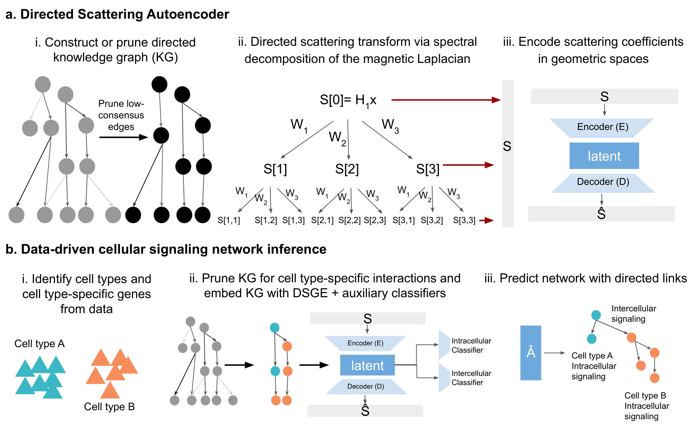

# Directed-Hierarchical-Gene-Networks

Comparison of representation approaches for directed graph embeddings, especially with latent tree-like or hierarchical structure, for study of intra- and intercellular signaling.

